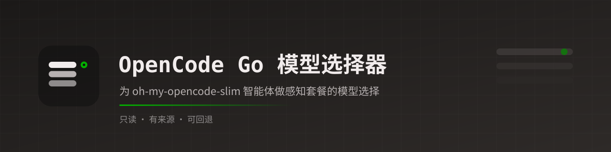

<p align="center">
  
</p>

<h1 align="center">OpenCode Go Model Picker</h1>

<p align="center">
  <em>为你的 OpenCode 智能体挑选合适的 OpenCode Go 模型——原生、oh-my-opencode-slim 或插件注入的都能用。只读、有来源、可回退。</em>
</p>

<p align="center">
  <a href="LICENSE"></a>
  
  
  
  
  <a href="https://skills.sh/sogeisetsu/opencode-go-model-picker"></a>
</p>

<p align="center">
  <a href="README.md">英文文档</a>
</p>

<p align="center">
  
</p>

为自己的智能体挑一个 OpenCode Go 里的模型，是件麻烦事：价格、月度额度、可用模型一直在变，而「最合适」的那个又取决于你更在意省钱还是更在意能力。这个技能就是替你做完这份功课的：它会读你的 OpenCode 智能体配置、查**当前**的 Go 套餐，然后给你每个自定义智能体推荐一个模型——如果你的配置支持，还会附上一条回退链。整个过程**只读**，在你点头之前什么都不改。

---

## 它能做什么

- **读懂你的智能体**——你自己定义的（JSON 或 Markdown）、`oh-my-opencode-slim` 预设里的，或其他插件提供的智能体。
- **每次运行都重新抓取 Go 套餐**，所以不会推荐已经下架的模型或过期的价格。
- **只给你的自定义智能体推荐模型。**「自定义」指不是 OpenCode 自带的一切：你自己写在 `opencode.jsonc` 或 Markdown 里的智能体、`oh-my-opencode-slim` 预设，以及其他插件提供的智能体——即使不支持回退链也算。
- **跳过 OpenCode 自带的智能体**——包括但不限于 Build、Plan 以及自带 subagent。OpenCode 各版本自带的智能体可能不同，所以规则是「OpenCode 自带的一律跳过」，而不是一份固定名单。
- **在支持的情况下给出回退链**，某个模型被限流时不会直接中断你的会话。
- **把依据摆出来。** 每个数字都带来源和抓取日期；拿不准的会明确标出，而不是猜。

有两件事它不会做：编造价格、额度或模型编号；以及不先给你看改动就直接动你的配置。

### 一个建议

如果方便，尽量把你的自定义智能体交给支持有序回退链的工具来管理——`oh-my-opencode-slim` 是其中之一，其他能做到同样事情的工具或插件也一样。理由很实际：Go 模型会被限流、会下架，有回退链时，首选模型不可用也不会中断你的会话。这只是个建议。你要是没有用，本技能照样能用——只是会为这些智能体推荐单个模型。

## 前置要求

- **OpenCode**，且支持 Agent Skills。技能会被放进 `~/.config/opencode/skills/`。
- **至少有一个自定义智能体**需要调优——你自己在 `opencode.jsonc` 或 Markdown 里定义的、一个 [`oh-my-opencode-slim`](https://github.com/alvinunreal/oh-my-opencode-slim) 预设里的，或其他插件提供的智能体。（OpenCode 自带的智能体不需要调优。）
  - `oh-my-opencode-slim` 是**可选**的。它只是本技能支持的来源之一；如果你正好在用，本技能会以它已安装的结构规范为准。
- **Node.js 18+**，仅辅助脚本需要（已在 Node 22 上测试）。

## 安装

把仓库克隆进 OpenCode 的技能目录，让文件夹名与技能的 `name` 一致：

**Linux / macOS**
```bash
git clone https://github.com/sogeisetsu/opencode-go-model-picker.git \
  ~/.config/opencode/skills/opencode-go-model-picker
```

**Windows (PowerShell)**
```powershell
git clone https://github.com/sogeisetsu/opencode-go-model-picker.git `
  "$env:USERPROFILE\.config\opencode\skills\opencode-go-model-picker"
```

**最小化安装。** 你不需要整个仓库。运行时只会用到 `SKILL.md`、`references/` 和 `scripts/`。只把这三样复制进 `~/.config/opencode/skills/opencode-go-model-picker/` 就行，其余（README、LICENSE、`assets/`、`zh/`……）都只是文档。

然后确认辅助脚本能跑起来：

```bash
node scripts/fetch-go-models.mjs   # 输出 { fetchedAt, source, count, ids }
```

### 让 AI Agent 帮你安装

把下面这段复制粘贴给你的 AI Agent：

```text
帮我安装 "OpenCode Go Model Picker" 这个技能。

1. 获取仓库：https://github.com/sogeisetsu/opencode-go-model-picker
2. 只把下面这些复制到我的全局 OpenCode 技能目录
   （~/.config/opencode/skills/opencode-go-model-picker/）：
   - SKILL.md
   - references/
   - scripts/
3. 不要复制仓库里的其他内容（README、LICENSE、assets 等）。
4. 验证：在安装目录里运行 "node scripts/fetch-go-models.mjs"，确认能输出 JSON。
5. 告诉我安装路径以及是否成功。
```

## 快速上手

安装完成后，在 OpenCode 里直接输入斜杠命令 `/opencode-go-model-picker` 即可调用，不需要再输入任何内容——技能会自己去读你的智能体配置、抓取当前 Go 套餐，然后给出推荐。

TUI 里如果它没出现在 `/` 的补全列表中，先输入 `/skills`，从技能列表里选同名项即可。

## 用法

用平常的话提问就行，比如：

- “帮我按最新 Go 套餐给每个智能体选模型。”
- “我现在的智能体模型配置还适合当前 Go 套餐吗？”
- “给我一份可直接粘贴的 OpenCode Go 预设配置，带回退链。”
- “我的智能体定义在 `opencode.jsonc` 里，帮我推荐模型。”
- “用 budget 模式，尽量帮我选便宜的模型。”

三种模式让你决定在价格和能力之间怎么取舍：

| 模式 | 它追求什么 |
|---|---|
| `budget` | 够用就行，选最便宜的。 |
| `balanced` | 最划算——价格与能力之间取平衡（默认）。 |
| `quality` | Go 上能力最强的，价格次要。 |

在提问时带上模式名，就会按你指定的来。不带的话，第一次使用时技能会问两个简短的加权问题（最在意什么、主要做什么），解析出模式，记住答案并在以后沿用——你随时可以点名模式覆盖它；跳过问题则直接用 `balanced`。报告里会附一张可审计的决策因素表。

在 `balanced` 下，对常用的高用量智能体，最贵的推荐应该只比当前「便宜但够用」的基线（写作时为 DeepSeek V4.1 Flash）贵一点点、且明显更强；如果没有模型达标，就推荐基线本身。

每次运行最后会给出一份六段式报告：

1. **套餐快照**——与你相关的模型，附来源和抓取时间。
2. **变化提示**——新增或下架的模型、额度、价格或预估请求数的变化，以及进行中的促销。
3. **当前配置**——找到的每个自定义智能体及其现有链路（只读）。
4. **推荐**——每个智能体推荐一个模型或一条链，附成本档位、吞吐量和理由，并对促销、地理或隐私方面的注意事项加标记。
5. **可粘贴配置**——一段可以直接放进配置的 JSONC。
6. **需人工核实**——仍需要人确认的项，以及验证命令。

之后它会**停下来问你**，确认后才应用。

## 工作原理

技能由一份指令文件（`SKILL.md`）加若干按需加载的参考文档组成。一次典型的运行是这样的：

1. **找到你的智能体**（只读）——`opencode.jsonc` 或 `~/.config/opencode/agents/*.md` 里的原生智能体、`oh-my-opencode-slim` 预设，以及你声明的其他插件来源。细节见 [`references/agent-sources.md`](references/agent-sources.md)。
2. **刷新模型快照**——`scripts/refresh-snapshot.mjs` 抓取实时目录，返回一份紧凑的新增/下架差异。LMArena 能力分优先取自提交进仓库的种子（`references/model-scores.json`）；只要它的榜单日期仍与 LMArena 最新一致就直接用，否则由 `scripts/refresh-scores.mjs` 抓取。免 key、全程不使用浏览器。全新模型会立刻查一次。
3. **核对套餐**——从当前套餐页面读取价格和额度并与缓存对比；只有新增或变化的模型才会做更深的能力核实。
4. **按角色特征给每个智能体挑模型**，并对已知角色做覆盖。策略见 `SKILL.md`。
5. **构建回退链**——一条有序的 `model: [a, b, c]` 故障转移列表（2–4 项）。
6. **输出报告**，并在动你的配置前先征得确认。

几点值得了解：

- **Go 额度是按模型计的月度美元金额。** 整体窗口为 5 小时 = 20%、每周 = 50%、每月 = 100%。因为每个模型各有限额，某个被限流时另一个 Go 模型仍然可用——所以第一层回退常常是另一个 Go 模型。
- **同样的美元额度 ≠ 同样的吞吐量。** 各模型每次请求消耗的 token 不同，所以套餐给出的**预估请求数**和美元额度一样重要。技能会从套餐页面读取（落地页更新更及时），在价格与能力接近时优先选请求数更高的模型。
- **它会标出隐藏条款。** 限时倍数（以及促销结束后回落到的基础额度）、有地理限制的模型、以及用你的 prompt 和补全结果训练模型的「Contributor」档，都会被明确指出——最后一项属于自愿选择，绝不会被悄悄推荐。
- **回退链取决于你用的工具。** 形如 `model: ["a", "b", "c"]` 的数组在 `oh-my-opencode-slim` 2.2.x 里是一条有序故障转移链（依据 `ForegroundFallbackManager` 核实）。如果每一项都失败，会话会中止，所以链尾应该是你真正能依赖的模型。直接定义在 OpenCode 里的智能体只接受单个 `model`（没有链），因此那里本技能只推荐一个模型并说明这一点。其他支持模型链的工具同样适用——使用 `oh-my-opencode-slim` 只是一个建议，并非必须。
- **能力看实验室文档，不看名字。** 模型的能力会去它所属实验室的官方文档里核实，绝不从模型编号猜。这对视觉类智能体（比如 `observer`）需要的**视觉**输入尤其重要。
- **能力评分随技能一起提供。** 提交进仓库的 LMArena 种子（`references/model-scores.json`）让第一次运行无需抓取并匹配排行榜。只有种子的榜单日期仍等于 LMArena 最新发布时才复用；匹配不到的分数保持 `null`，绝不猜。评分是 LMArena 的 Arena ELO（`overall` / `coding` / `vision`），不是 0–100；LMArena 没有 cost 列，所以 cost 保持 `null`。
- **价格同样随技能一起提供。** 提交进仓库的价格种子（`references/model-prices.json`）让套餐页面抓取不到时，逐模型价格依然离线可读。只有实时读取才算当前值；种子值汇报时一定附带日期。
- **失败路径是显式的。** 刷新脚本失败、或两个脚本并发写同一份快照时，会改为串行重跑并读回确认。目录或网络不可达时，技能回退到快照缓存和提交进仓库的带日期种子，并给每个数值标注其日期。非 Go 回退 id 会先对照本地模型注册表的 `status` 核实才会被推荐；所有数据源都不可达时直接停止，绝不编造数字。
- **省 token。** `~/.cache/opencode/opencode-go-model-picker/snapshot.json` 里缓存了一份归一化后的目录和评分，每次运行只重新抓取、重新核实发生变化的部分。缓存绝不取代来源——每个值都带来源和抓取日期。见 [`references/model-snapshot.md`](references/model-snapshot.md)。

## 数据来源

每次运行都重新抓取。完整清单与解析注意事项见 [`references/data-sources.md`](references/data-sources.md)。

| 优先级 | 来源 | 网址 | 提供内容 |
|---|---|---|---|
| 1 | Go 落地页 | https://opencode.ai/go | 最新促销 + 带每 5 小时预估请求数的精选用量表 |
| 2 | Go 文档 | https://opencode.ai/docs/go/ | 完整模型 / 价格 / 月度额度表 + 预估请求数 |
| 3 | 模型端点 | https://opencode.ai/zen/go/v1/models | 实时目录编号（经 `scripts/fetch-go-models.mjs`） |
| 4 | models.dev | https://models.opencode.ai/providers/opencode-go/ | 上下文 / 输出 / 价格 / 能力 |
| 5 | julien.cloud 追踪 | https://julien.cloud/opencode-go-models/ | 合并视图 + 价格变动 / 弃用日志 |
| 6 | LMArena | https://lmarena.ai/（[数据集](https://huggingface.co/datasets/lmarena-ai/leaderboard-dataset)，经 HF datasets-server） | Arena ELO：overall / coding / vision（仓库种子；免 key、无浏览器） |
| — | 价格种子 | `references/model-prices.json`，经 https://models.dev/api.json（provider `opencode-go`）刷新 | 提交进仓库的逐模型输入 / 输出 / 缓存读取价格、上下文、输出上限（带日期的离线回退；实时读取始终优先） |

## 安全与隐私

- **默认只读。** 在你确认之前不会写入任何东西；确认之后，你会看到确切的改动——无论它落在 `oh-my-opencode-slim.json`、`opencode.jsonc`、智能体 Markdown 文件还是别处。
- **本地读取：** `~/.config/opencode/` 下的 OpenCode 配置（含 `agents/`），以及已安装插件的结构规范。
- **网络访问：** 上面那些公开页面、免鉴权的 `opencode.ai` 模型端点，以及仅在评分种子过期时访问的公开 LMArena 数据集（Hugging Face）。如配置了系统代理会自动使用。不发送凭据，也不发送个人数据。
- **不编造数字。** 每个数值都带来源与抓取日期；无法核实的会标记出来等你人工确认。
- **非官方。** 本项目与 OpenCode、SST 或任何模型厂商均无隶属、背书或赞助关系。模型名称与价格归各自所有者。

## 参与贡献

欢迎贡献。详见 [`CONTRIBUTING-ZH.md`](zh/CONTRIBUTING-ZH.md)（中文）或 [`CONTRIBUTING.md`](CONTRIBUTING.md)（英文）。

出于个人隐私，本项目有意**不**提交 `AGENTS.md`（与常见约定不同）。可共享的约定见 [`CONTRIBUTING-ZH.md`](zh/CONTRIBUTING-ZH.md)。

## 更新日志

详见 [`CHANGELOG-ZH.md`](zh/CHANGELOG-ZH.md)（中文）或 [`CHANGELOG.md`](CHANGELOG.md)（英文）。

## 许可证

版权所有（C）2026 sogeisetsu

基于 **GNU 通用公共许可证第 3 版或更新版本**（`GPL-3.0-or-later`）授权。

本程序为自由软件：你可以依据自由软件基金会发布的 GNU 通用公共许可证条款，对本程序进行再发布及/或修改，许可版本为第三版，或（随你选择）任何更新的版本。发布本程序的目的是希望它有用，但不提供任何担保；甚至不保证其具有经济价值或适合特定用途。详情参见 GNU 通用公共许可证。

完整文本见 [`LICENSE`](LICENSE)（英文原文，具法律效力），或查阅 [`zh/LICENSE-ZH.md`](zh/LICENSE-ZH.md)（非官方中文参考译本）。

## 由来

本项目源于 2026 年 9 月的一次调研：当时没有任何官方或知名技能能做「感知套餐的 OpenCode Go 智能体模型选择」。最接近的同类是面板生成器 [`itsmylife44/cliproxyapi-dashboard`](https://github.com/itsmylife44/cliproxyapi-dashboard)（`oh-my-opencode-slim-config-generator.tsx`，MIT 许可），以及成本画像需求 [`code-yeongyu/oh-my-openagent#1768`](https://github.com/code-yeongyu/oh-my-openagent/issues/1768)。这里复用了 OpenCode Go 的官方数据来源，以及 `oh-my-opencode-slim` 静态的按智能体角色指引。后来从「仅支持 `oh-my-opencode-slim`」扩展为支持任意 OpenCode 智能体来源——见 [`references/agent-sources.md`](references/agent-sources.md)。
