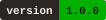
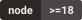
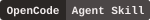
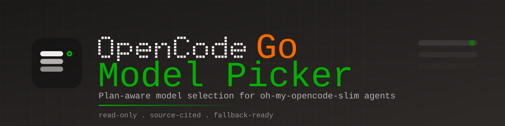

<p align="center">
  
</p>

<h1 align="center">OpenCode Go Model Picker</h1>

<p align="center">
  <em>Plan-aware model selection for your OpenCode agents — native, oh-my-opencode-slim, or plugin-injected. Read-only, source-cited, fallback-ready.</em>
</p>

<p align="center">
  <a href="LICENSE"></a>
  
  
  
  
</p>

<p align="center">
  <a href="README-ZH.md">Chinese documentation</a>
</p>

<p align="center">
  
</p>

Choosing which OpenCode Go model each of your agents should use is fiddly. Prices,
monthly caps, and the list of available models change constantly, and the "best"
pick depends on whether you care more about cost or capability. This skill does
that homework for you: it reads your OpenCode agent config, checks the **current**
Go plan, and suggests a model for each of your custom agents — plus a fallback
chain when your setup supports one. It is **read-only**, so nothing changes until
you say yes.

---

## What it does

- **Reads your agents** — your own agents (JSON or Markdown), `oh-my-opencode-slim`
  presets, or agents from another plugin.
- **Fetches the Go plan fresh on every run**, so it never suggests a retired model
  or an outdated price.
- **Recommends a model for each custom agent.** "Custom" means any agent OpenCode
  doesn't ship: your own agents in `opencode.jsonc` or Markdown files,
  `oh-my-opencode-slim` presets, and agents from other plugins — even those
  without fallback-chain support.
- **Skips OpenCode's built-in agents** — including but not limited to Build, Plan,
  and the built-in subagents. Which agents OpenCode ships can change between
  versions, so the rule is "anything OpenCode ships is skipped", not a fixed list.
- **Adds a fallback chain** where the source supports one, so hitting a capped
  model doesn't end your session.
- **Shows its work.** Every number comes with a source and a fetch date, and
  anything it can't verify is flagged instead of guessed.

Two things it will never do: invent a price, limit, or model ID, and change your
config without showing you the change first.

### A suggestion

If you can, register your custom agents through a tool that supports ordered
fallback chains — `oh-my-opencode-slim` is one, and any other tool or plugin that
does the same works just as well. The reason is resilience: Go models get
rate-limited and retired, and a chain keeps your session running when the first
choice is unavailable. This is only a suggestion. If you don't use one, the skill
still works — it just recommends a single model for those agents.

## Requirements

- **OpenCode** with Agent Skills support. The skill lives in
  `~/.config/opencode/skills/`.
- **At least one custom agent to tune** — an agent you define yourself in
  `opencode.jsonc` or a Markdown file, an
  [`oh-my-opencode-slim`](https://github.com/alvinunreal/oh-my-opencode-slim)
  preset, or an agent from another plugin. (OpenCode's built-in agents don't need
  tuning.)
  - `oh-my-opencode-slim` is **optional**. It is only one of the supported
    sources; if you happen to use it, the skill treats its installed schema as the
    source of truth.
- **Node.js 18+**, only for the helper scripts (tested on Node 22).

## Installation

Clone the repository into your OpenCode skills directory, so the folder name
matches the skill's `name`:

**Linux / macOS**
```bash
git clone https://github.com/sogeisetsu/opencode-go-model-picker.git \
  ~/.config/opencode/skills/opencode-go-model-picker
```

**Windows (PowerShell)**
```powershell
git clone https://github.com/sogeisetsu/opencode-go-model-picker.git `
  "$env:USERPROFILE\.config\opencode\skills\opencode-go-model-picker"
```

**Minimal install.** You don't need the whole repository. At runtime the skill
only uses `SKILL.md`, `references/`, and `scripts/`. Copy just those three into
`~/.config/opencode/skills/opencode-go-model-picker/` and skip the rest (README,
LICENSE, `assets/`, `zh/`, …) — they are documentation only.

Then check that the helper script runs:

```bash
node scripts/fetch-go-models.mjs   # prints { fetchedAt, source, count, ids }
```

### Let an AI agent install it

Copy the block below and paste it to your AI agent:

```text
Install the "OpenCode Go Model Picker" skill for me.

1. Get the repository: https://github.com/sogeisetsu/opencode-go-model-picker
2. Copy only these into my global OpenCode skills directory
   (~/.config/opencode/skills/opencode-go-model-picker/):
   - SKILL.md
   - references/
   - scripts/
3. Do not copy the rest of the repo (README, LICENSE, assets, ...).
4. Verify by running "node scripts/fetch-go-models.mjs" inside the installed
   folder and confirming it prints JSON.
5. Tell me the install path and whether it worked.
```

## Usage

Just ask in plain language. For example:

- "Pick the best OpenCode Go models for each of my agents."
- "Is my current agent model config still a good fit for the current Go plan?"
- "Give me a paste-ready preset block for OpenCode Go, with fallbacks."
- "I define my agents in `opencode.jsonc` — recommend models for them."
- "Use budget mode — keep my agent models as cheap as possible."

Three modes let you decide the trade-off between price and capability:

| Mode | What it optimizes for |
|---|---|
| `budget` | The cheapest model that still does the job. |
| `balanced` | The best value — a sensible mix of price and capability (default). |
| `quality` | The strongest model on Go, with cost as a secondary concern. |

Name a mode in your request and it is used as-is. If you don't name one, the skill
asks a couple of quick questions the first time (what matters most, how often you
use it, what you use it for), remembers the answer, and reuses it on later runs —
you can always name a mode to override it, and skipping the questions just uses
`balanced`.

In `balanced`, the priciest pick for a normal high-volume agent should be only
slightly more expensive than the current cheap-but-capable baseline (DeepSeek V4.1
Flash at the time of writing) and clearly stronger; if nothing clears that bar, the
baseline itself is the pick.

Every run ends with a six-part report:

1. **Plan snapshot** — the models relevant to you, with source and fetch date.
2. **What changed** — new or removed models, changed limits, prices, or estimated
   request counts, active promos.
3. **Current** — every custom agent found and its current chain (read-only).
4. **Recommendation** — a model or chain per agent, with the cost tier, throughput,
   and the reason, plus flags for any promo, geo, or privacy caveat.
5. **Paste-ready** — a JSONC block you can drop into your config.
6. **Verify** — anything that still needs a human check, plus the commands to do it.

The skill then **stops and asks** before applying anything.

## How it works

The skill is a set of instructions (`SKILL.md`) plus references it loads only when
needed. A typical run goes like this:

1. **Find your agents** (read-only) — native agents in `opencode.jsonc` or
   `~/.config/opencode/agents/*.md`, `oh-my-opencode-slim` presets, and any other
   plugin source you declare. The details live in
   [`references/agent-sources.md`](references/agent-sources.md).
2. **Refresh its model snapshot** — `scripts/refresh-snapshot.mjs` fetches the
   live catalog and returns a compact added/removed diff. LMArena ability scores
   come from a committed seed (`references/model-scores.json`) when it still
   matches the latest LMArena boards; otherwise `scripts/refresh-scores.mjs`
   fetches them. No key and no browser are involved. A brand-new model is always
   looked up right away.
3. **Check the plan** — prices and limits are read from the current plan pages and
   compared with the cache; only the added or changed models get a deeper
   capability check.
4. **Pick a model per agent** by role trait, with overrides for known roles. See
   the allocation policy in `SKILL.md`.
5. **Build fallback chains** — an ordered `model: [a, b, c]` failover list (2–4
   entries).
6. **Write the report** and ask for confirmation before touching your config.

A few details worth knowing:

- **Go limits are per model, in monthly dollars.** The overall window is 5 hours =
  20%, weekly = 50%, monthly = 100%. Because each model has its own limit, another
  Go model is still usable when one is capped — which is why the first fallback is
  often another Go model.
- **Same $ limit ≠ same throughput.** Models burn different numbers of tokens per
  request, so the plan's estimated request counts matter as much as the dollar
  limit. The skill reads them from the plan pages (the landing page is the more
  timely one) and prefers the higher count when price and capability tie.
- **It flags the fine print.** Limited-time multipliers (with the base limit they
  fall back to), geo-restricted models, and "Contributor" tiers that train on your
  prompts and completions are called out — the last one is opt-in and never
  recommended silently.
- **Fallback chains depend on your tool.** An array like `model: ["a", "b", "c"]`
  is an ordered failover chain in `oh-my-opencode-slim` 2.2.x (verified against
  `ForegroundFallbackManager`). If every entry fails, the session aborts, so the
  chain should end on a model you can rely on. Agents defined directly in OpenCode
  take a single `model` (no chain), so there the skill recommends one model and
  says so. Any other tool that supports chains works just as well — using
  `oh-my-opencode-slim` is only a suggestion, not a requirement.
- **Capabilities come from the lab, not the name.** The skill verifies a model's
  abilities in its own lab documentation, never infers them from the model ID.
  This matters most for **vision** input, which vision-capable agents (such as
  `observer`) need.
- **Ability scores ship with the skill.** A committed LMArena seed
  (`references/model-scores.json`) means the first run does not have to fetch and
  match the leaderboards. It is reused only while its board dates still match
  LMArena's latest release; `null` scores are left unfilled rather than guessed.
  The scores are LMArena Arena ELO ratings (`overall` / `coding` / `vision`), not
  0–100, and LMArena has no cost column, so cost stays `null`.
- **It saves tokens.** A cached snapshot at
  `~/.cache/opencode/opencode-go-model-picker/snapshot.json` holds the normalized
  catalog and scores, so each run re-fetches and re-verifies only what changed.
  The cache never replaces a source — every value keeps its source and fetch date.
  See [`references/model-snapshot.md`](references/model-snapshot.md).

## Data sources

Fetched fresh every run. Full details and parsing notes are in
[`references/data-sources.md`](references/data-sources.md).

| Priority | Source | URL | Gives |
|---|---|---|---|
| 1 | Go landing page | https://opencode.ai/go | latest promos + featured usage table with estimated requests per 5h |
| 2 | Go docs | https://opencode.ai/docs/go/ | full model / price / monthly-limit table + estimated requests |
| 3 | Models endpoint | https://opencode.ai/zen/go/v1/models | live catalog ids (via `scripts/fetch-go-models.mjs`) |
| 4 | models.dev | https://models.opencode.ai/providers/opencode-go/ | context / output / price / capabilities |
| 5 | julien.cloud tracker | https://julien.cloud/opencode-go-models/ | merged view + price-change / deprecation log |
| 6 | LMArena | https://lmarena.ai/ ([dataset](https://huggingface.co/datasets/lmarena-ai/leaderboard-dataset) via the HF datasets-server) | Arena ELO: overall / coding / vision (committed seed; no key, no browser) |

## Safety and privacy

- **Read-only by default.** Nothing is written until you confirm, and then you see
  exactly what changes — in `oh-my-opencode-slim.json`, `opencode.jsonc`, agent
  Markdown files, or wherever the change belongs.
- **Local reads:** your OpenCode config under `~/.config/opencode/` (including
  `agents/`) and the installed plugin's schema.
- **Network access:** the public pages above, the unauthenticated `opencode.ai`
  models endpoint, and — only when the score seed is stale — the public LMArena
  dataset on Hugging Face. A system proxy is used automatically if configured. No
  credentials and no personal data are sent.
- **No invented numbers.** Every figure carries a source and a fetch date, and
  anything unverifiable is flagged for a manual check.
- **Unofficial.** This project is not affiliated with, endorsed by, or sponsored
  by OpenCode, SST, or any model vendor. Model names and prices belong to their
  respective owners.

## Contributing

Contributions are welcome. See [`CONTRIBUTING.md`](CONTRIBUTING.md) (English) or
[`CONTRIBUTING-ZH.md`](zh/CONTRIBUTING-ZH.md) (Chinese).

For personal privacy this project intentionally does **not** commit a project
`AGENTS.md`, contrary to the usual convention. Shareable conventions live in
[`CONTRIBUTING.md`](CONTRIBUTING.md).

## Changelog

See [`CHANGELOG.md`](CHANGELOG.md) (English) or
[`CHANGELOG-ZH.md`](zh/CHANGELOG-ZH.md) (Chinese).

## License

Copyright (C) 2026 sogeisetsu

Licensed under the **GNU General Public License v3.0 or later** (`GPL-3.0-or-later`).

This project is free software: you can redistribute it and/or modify it under the
terms of the GNU General Public License as published by the Free Software
Foundation, either version 3 of the License, or (at your option) any later
version. It is distributed in the hope that it will be useful, but WITHOUT ANY
WARRANTY; without even the implied warranty of MERCHANTABILITY or FITNESS FOR A
PARTICULAR PURPOSE. See the GNU General Public License for more details.

See [`LICENSE`](LICENSE) for the full text (the authoritative English version), or
[`zh/LICENSE-ZH.md`](zh/LICENSE-ZH.md) for an unofficial Chinese reference translation.

## Provenance

Built after surveying existing options (September 2026): no official or well-known
skill does plan-aware OpenCode Go agent model selection. Closest analogs are the
dashboard generator
[`itsmylife44/cliproxyapi-dashboard`](https://github.com/itsmylife44/cliproxyapi-dashboard)
(`oh-my-opencode-slim-config-generator.tsx`, MIT) and the cost-profile request
[`code-yeongyu/oh-my-openagent#1768`](https://github.com/code-yeongyu/oh-my-openagent/issues/1768).
Official Go data sources plus `oh-my-opencode-slim`'s static per-agent role
guidance are reused here. The skill was later generalized from
`oh-my-opencode-slim`-only to any OpenCode agent source — see
[`references/agent-sources.md`](references/agent-sources.md).
